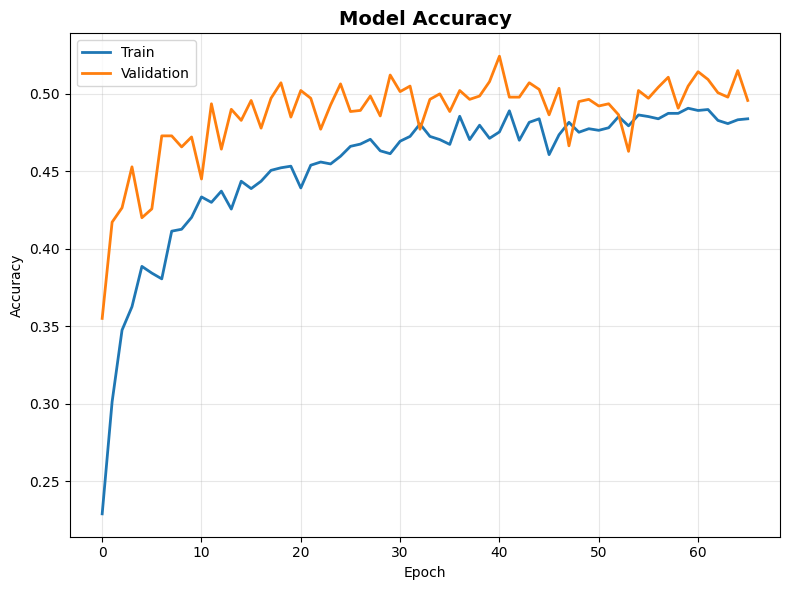
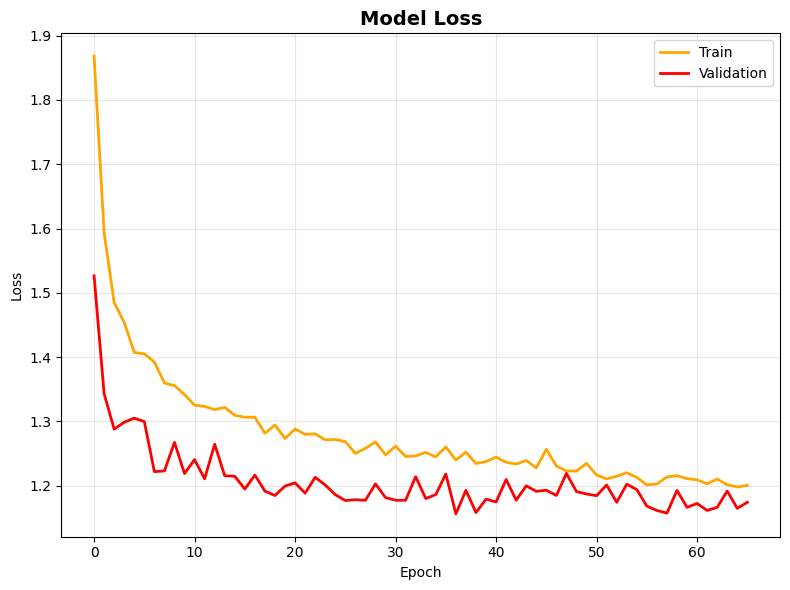
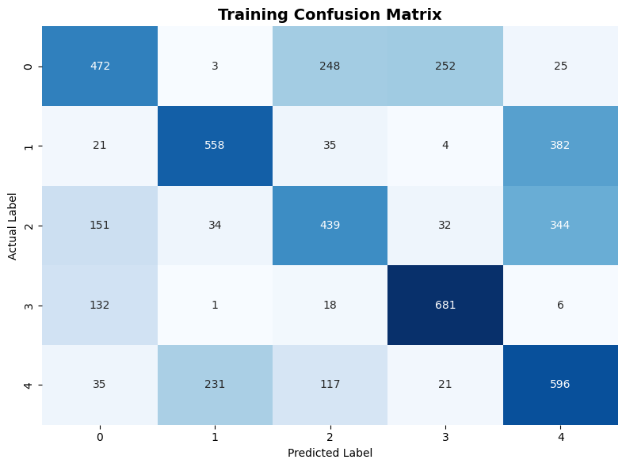
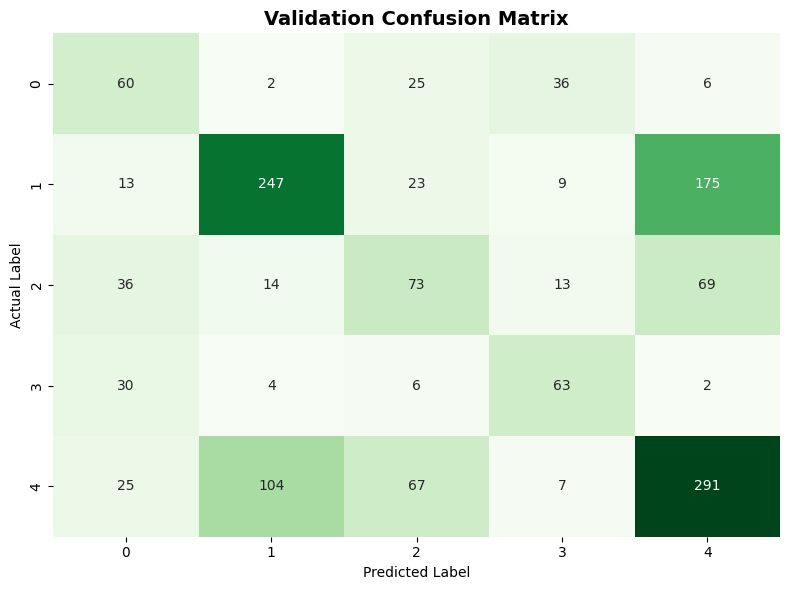

##  Project Overview

This repository contains a multi-class sentiment analysis system developed for  [NN-26 Review Sentiment Classification](https://www.kaggle.com/competitions/nn-26-review-sentiment-classification) competition as part of the Neural Networks course at the Faculty of Computer and Information Sciences, Ain Shams University.

The primary objective is to categorize text reviews into five distinct sentiment levels: Excellent, Very Good, Good, Bad, and Very Bad. The project explores the trade-offs between local pattern recognition (CNNs), sequential dependency (GRUs), and global semantic understanding (Transformers and Sentence Embeddings).
---

##  Performance Statistics
Our experimental journey followed a clear progression from basic sequential models to advanced attention-based architectures.

### High-Level Model Comparison
| Model Architecture | Private Score | Public Score | Key Observation |
| :--- | :--- | :--- | :--- |
| **Sentence Embedding and Dense** | **0.53303** | 0.52729 | **Most Consistent & Reliable** |
| **Multi-Head Attention ** | 0.53289 | **0.53631** | Best Public Leaderboard Result |
| **Bi-GRU ** | 0.51581 | 0.50521 | Captured sequential context but prone to overfitting |
| **1D CNN** | 0.49143 | 0.47676 | Fast but struggled with deep semantic nuances |

---

##  Results

### Accuracy (Train vs Validation)

### Loss (Train vs Validation)

### Training Confusion Matrix

### Validation Confusion Matrix

---

##  Technical Methodology

### 1. Preprocessing Pipeline
* **Text Normalization:** Lowercasing and removing extra punctuation/whitespace.
* **Token Protection:** Splitting contractions (e.g., `isn't` → `is not`) to preserve critical negative sentiment indicators.
* **Noise Reduction:** All URLs were replaced with a `<URL>` token to prevent the model from learning irrelevant web signatures.

### 2. Smart Augmentation & Balancing
The dataset was heavily skewed toward positive reviews. We solved this through:
* **Synonym Replacement:** Using NLP libraries to generate variations of minority class reviews.
* **Strategic Resampling:** Downsampling the "Excellent" class while upsampling "Bad" and "Very Bad" classes.
* **Sample Weighting:** Assigning higher penalties to the loss function for misclassifying underrepresented labels.

---

## 📂 Project Structure

- **models/**
  - `sentence-embedding-dense.ipynb`: Dense classifier using sentence embeddings.
  - `transformer.ipynb`: Transformer-based architecture implementation.
  - `cnn1d_GRU.ipynb`: Baseline CNN1D + GRU model.
  - `test-script.ipynb`: Batch inference & submission generation.

- **results/**
  - Training/Validation accuracy & loss curves.
  - Confusion matrices for both datasets.

- **report/**
  - `project report .pdf`: Final academic documentation.
  - `project report .docx`: Editable version.
---
